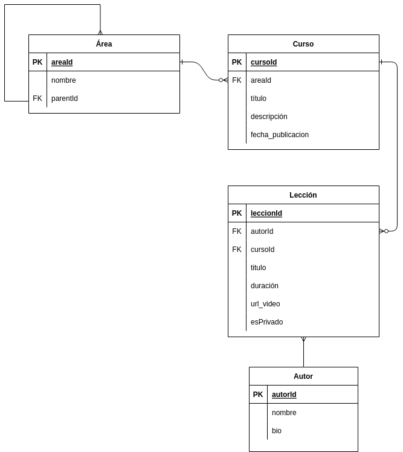

# Laboratorio Modelado Relacional

## Enunciado
Una startup tecnológica va a desarrollar un portal de ELearning y nos ha pedido que realizamos el modelo de datos de dicho sistema.

A tener en cuenta:

* Va a ser un portal orientado al mundo de la programación.
* El portal va a estar compuesto por cursos, cada curso está compuesto a su vez por un número de videos y artículos que lo acompañen.
* Los videos y el contenido de cada artículo se almacenan en un storage S3 y en un headless CMS, en la base de datos sólo almacenaremos los Id's a esos recursos.
* Los videos se puede clasificar por temáticas (Devops / Front End / Back End / ...)
* Los videos tienen autores (ponemos la restricción, un video tiene un autor), un curso puede tener varios autores.

### Parte obligatoria
Generar un modelado que refleje los siguiente requerimientos:

* Queremos mostrar los últimos cursos publicados.
* Queremos mostrar cursos por área (devops / front End ...).
* Queremos mostrar un curso con sus videos.
* En un video queremos mostrar su autor.

### Parte opcional
Tener un sólo nivel de áreas es limitado, lo suyo sería tener una estructura jerárquica, por ejemplo:
* Front End >> React
* Front End >> React >> Testing
* Front End >> Angular
* Devops >> Dockers
* Devops >> Serverless
* Backend >> nodejs
* Backend >> nodejs >> Express
* Backend >> mongo
Van a haber videos publicos y privados, es decir:
* Un curso puede ser 100% publico.
* Un curso puede tener una parte inicial 100% pública, y otra sólo para subscriptores.
* Esto implica que hayan usuarios registrados y subscripciones.

## Resolución
